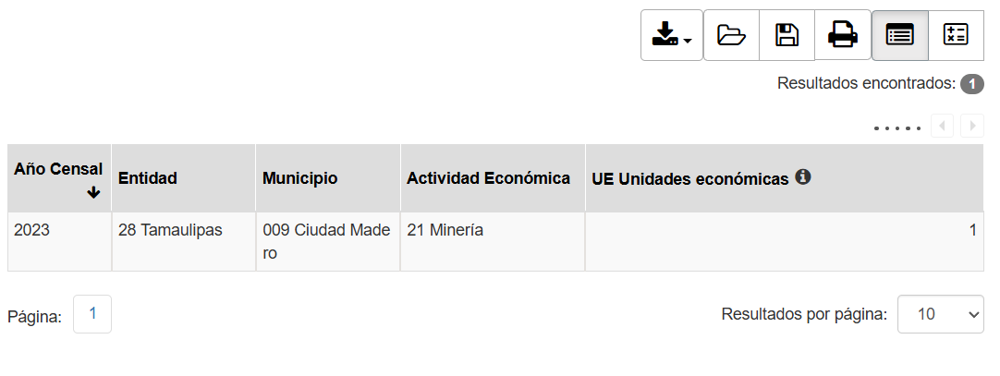

# Glosario de variables

Los archivos CSV de este conjunto de datos usan encabezados abreviados con el formato: CódigoVariable_Año.
El texto descriptivo se eliminó para ahorrar espacio. El siguiente glosario relaciona cada código con su descripción completa.

* A111A: Producción bruta total (millones de pesos)
* A121A: Consumo intermedio (millones de pesos)
* A131A: Valor agregado censal bruto (millones de pesos)
* A211A: Inversión total (millones de pesos)
* A221A: Formación bruta de capital fijo (millones de pesos)
* H001A: Personal ocupado total
* Q000A: Acervo total de activos fijos (millones de pesos)
* 
# **Obtención de las proporciones** 
(Estatal / Nacional)

1. A111A (Producción bruta total estatal / nacional) = Proporción del peso del estado en la producción bruta total nacional
2. A121A (Consumo intermedio estatal / nacional) = Proporción del peso del estado en el consumo intermedio nacional
3. A131A (Valor agregado censal bruto estatal / nacional) = Proporción del peso del estado en el valor agregado censal bruto nacional
4. A221A (Formación bruta de capital fijo estatal / nacional) = Proporción del peso del estado en la formación bruta de capital fijo nacional

(Región / Estatal)

1. A111A (Producción bruta total regional / estatal) = Proporción del peso de la región en la producción bruta total estatal
2. A121A (Consumo intermedio regional / estatal) = Proporción del peso de la región en el consumo intermedio estatal
3. A131A (Valor agregado censal bruto regional / estatal) = Proporción del peso de la región en el valor agregado censal bruto estatal
4. A221A (Formación bruta de capital fijo regional / estatal) = Proporción del peso de la región en la formación bruta de capital fijo estatal

# Problemas con la base de datos:
En todo momento el INEGI omite datos de mineria del Estado de Tamaulipas.
Ciudad Madero es un caso especial porque especificamente el INEGO se dio la tarea de eliminar todo rastro de estadistica censal
de minera y petrolera. La suma de Ciudad Madero con cifras oficiales hace que Mineria y petroleo de 0. 

Variable checksum indica lo que suma todo los valores de los sectores en una columna.

# Interpretacion 

# Ejemplo 1: Eliminación intencional de valores por parte del INEGI
A continuación se muestra la fila "Sector 21 Minería" del archivo municipal 009 Ciudad Madero.csv, mostrando únicamente las columnas A131A.

| Actividad Economica | A131A_2003 | A131A_2008 | A131A_2013 | A131A_2018 | A131A_2023 |
|---|---|---|---|---|---|
| Sector 21 Minería | N/A | N/A | N/A | N/A | C |

Interpretación:
- N/A = No hay dato porque la actividad no existe en el municipio en ese año.
- C = Dato confidencial: la actividad existe, pero el valor está reservado.

En Ciudad Madero, los años 2003–2018 aparecen como N/A para este sector, mientras que en 2023 aparece C. Véanse las Unidades Económicas:

Llama la atención que no existan registros de Unidades Económicas entre 2003 y 2018 y que en 2023 sí aparezca una (1). Por lógica, es evidente a quién pertenece: la Refinería Francisco I. Madero de PEMEX, que tiene más de 100 años y continúa operando.
Esto sugiere que, en los censos 2003–2018, se depuraron u ocultaron datos de manera intencional —incluida la existencia de la unidad económica— para no reflejar la presencia de la empresa en el censo.
En 2023 se muestra que existe una única unidad económica, pero todos sus valores están marcados como confidenciales.

Usted puede corroborarlo en el SAIC aplicando estos filtros: todos los Años Censales; Municipio: 009 Ciudad Madero, Tamaulipas; Variables: Unidades económicas y Minería. El resultado esperado es el mostrado arriba.

Adicionalmente, al comparar el total municipal (suma de todos los sectores, "checksum") contra la cifra oficial del municipio, solo caben dos interpretaciones:
- El valor de Minería y Petróleo es efectivamente cero en todos los años; o
- El valor fue excluido del total municipal para impedir la ingeniería inversa de los datos.

| Actividad Economica | A131A_2018 |
|---|---|
| Sector 11 Agricultura, cría y explotación de animales, aprovechamiento forestal, pesca y caza | 8.722 |
| Sector 21 Minería | N/A |
| Sector 23 Construcción | 155.073 |
| Sector 31-33 Industrias manufactureras | 8093.66 |
| Sector 43 Comercio al por mayor | 5497.96 |
| Sector 46 Comercio al por menor | 2141.935 |
| Sector 48-49 Transportes, correos y almacenamiento | 1949.073 |
| Sector 51 Información en medios masivos | 57.221 |
| Sector 52 Servicios financieros y de seguros | 71.172 |
| Sector 53 Servicios inmobiliarios y de alquiler de bienes muebles e intangibles | 116.116 |
| Sector 54 Servicios profesionales, científicos y técnicos | 13.353 |
| Sector 56 Servicios de apoyo a los negocios y manejo de residuos, y servicios de remediación | 229.336 |
| Sector 61 Servicios educativos | 186.445 |
| Sector 62 Servicios de salud y de asistencia social | 99.111 |
| Sector 71 Servicios de esparcimiento culturales y deportivos, y otros servicios recreativos | 149.406 |
| Sector 72 Servicios de alojamiento temporal y de preparación de alimentos y bebidas | 464.535 |
| Sector 81 Otros servicios excepto actividades gubernamentales | 174.287 |
| Total 009 Ciudad Madero | 19407.405 |
| checksum | 19407.405 |

Ejemplo de omitir valores intencionalmente. El checksum es la suma de todos los valores de la columna.
El Total 009 Ciudad Madero es el total reportado por el INEGI. 

# Ejemplo 2: Valores confidenciales

| Actividad Economica | A111A_2003 | A111A_2008 | A111A_2013 | A111A_2018 | A111A_2023 |
|---|---|---|---|---|---|
| Sector 55 Dirección y administración de grupos empresariales o corporativos | C | C | C | C | C |

Tome el ejemplo de Tampico. El municipio cuenta con un sector que es considerado como raro que es "Sector 55 Dirección y administración de grupos empresariales o corporativos".
Este sector tiene en todos sus variables censales C. Si se busca en unidades economicas se ve que si existe actividad de este tipo en Tampico.

| Año Censal | Entidad | Municipio | Actividad económica | UE Unidades económicas |
|---|---|---|---|---|
| 2023 | 28 Tamaulipas | 038 Tampico | Sector 55 Dirección y administración de grupos empresariales o corporativos | 1 |

El motivo de no mostrar estos valores es que seria sencillo buscar la unica empresa en el municipio que se dedique a esta actividad y como es la unica se
deduce automaticamente que todos los valores de la fila serian de esa empresa.

# IDE
- PyCharm 

# Base de datos
https://www.inegi.org.mx/app/saic/
		
	
# Autor 
Homero P. Mata
Freelancer
Desarrollado para la Secretaria de Economia de Tamaulipas